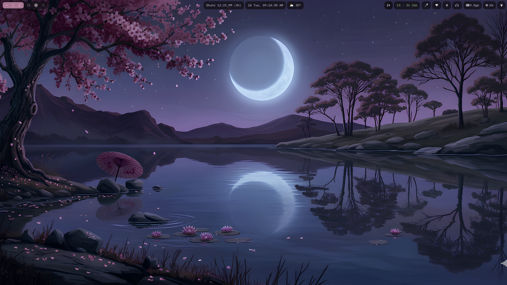
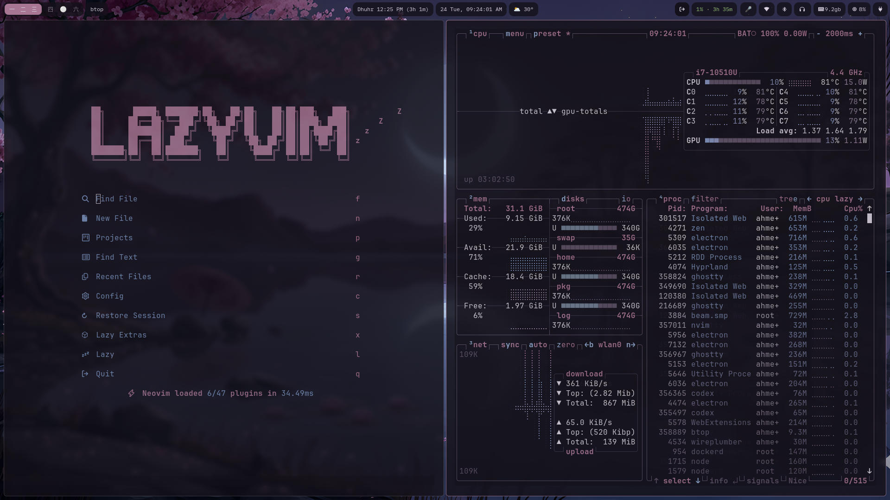

# Sakurazuki

Dark low-contrast Omarchy theme built around a sakura wallpaper.

## Installation

```bash
omarchy-theme-install https://github.com/ahmed-z0/omarchy-sakurazuki-theme.git
```

- Wallpaper: `backgrounds/sakura.png`
- Palette: near-black plum base, muted rose accents, moonlit blue highlights

## Preview



