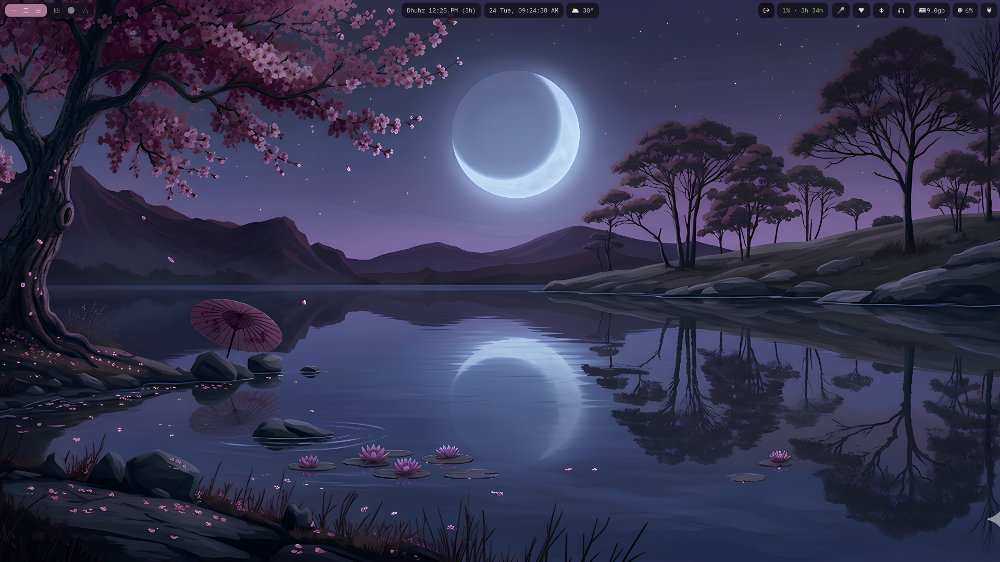
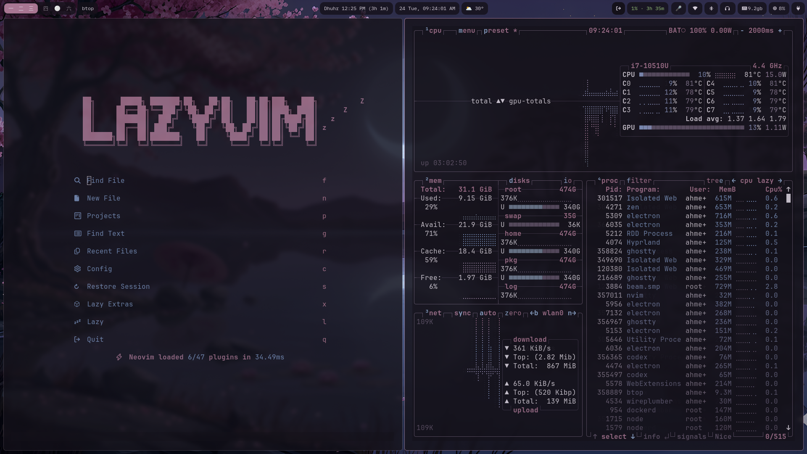

# Sakurazuki

Dark low-contrast Omarchy theme built around a sakura wallpaper — near-black plum base, muted rose accents, moonlit blue highlights.

Compatible with the current Omarchy Quattro release (Quickshell-based shell).

## Preview


## Installation

```bash
omarchy-theme-install https://github.com/Deoxizn/omarchy-sakurazuki-theme.git
```

For the upstream original:

```bash
omarchy-theme-install https://github.com/ahmed-z0/omarchy-sakurazuki-theme.git
```

## What's Included

- Native Omarchy 4 / Quattro support through the semantic `colors.toml` palette and handcrafted `shell.toml` surfaces. Hyprland borders and Neovim are generated from `colors.toml` (`hyprland_active_border` → `hyprland.lua`, `aether.nvim` via `neovim.lua.tpl`).
- `backgrounds/sakura.png` — wallpaper (with `preview.png`, `preview-unlock.png`, `unlock.png` for the theme switcher)
- Companion theme files for Vencord (`vencord.theme.css`), Warp (`warp.yaml`), Chromium (`chromium.theme`), and Zed (`sakurazuki.zed.json`)
- Handcrafted overrides for `gtk.css`, `walker.css`, `waybar.css`, `swayosd.css`, `mako.ini`, `colors.css`, `cava`, `foot.ini`, and `sakurazuki.override.css` (Aether/GUI)
- Quattro generates `hyprland.lua`, `neovim.lua`, and terminal configs (`alacritty.toml`/`kitty.conf`/`ghostty.conf`/`foot.ini`/`vscode.json`) from `colors.toml` when the theme is installed from a git repo (those files are not shipped; see `INSTALLED_THEME_DENIED` in `omarchy-theme-set`)
- `icons.theme` (Yaru-magenta)

## Palette

Near-black plum base, muted rose accents, moonlit blue highlights.

| Role   | Color     |
|--------|-----------|
| bg     | `#14111A` |
| fg     | `#D8D0DC` |
| accent | `#B6849D` |
| muted  | `#6B5E72` |
| red    | `#8D5F74` |
| green  | `#6F7B8F` |
| yellow | `#9A84A2` |
| blue   | `#A87692` |
| magenta| `#947598` |
| cyan   | `#7E95C1` |

`hyprland_active_border` is a rose → moonlit gradient (`rgba(b6849dee) rgba(a1809acc) 45deg`), `hyprland_inactive_border` is a muted plum (`rgba(655763aa)`).

## Notes

- `colors.toml` is the single source of truth — `hyprland.lua` (borders), `neovim.lua` (aether.nvim v3), and terminal configs are generated from it when installed via `omarchy-theme-install`. No `*.lua`, `alacritty.toml`, `foot.ini`, `ghostty.conf`, `kitty.conf`, or `vscode.json` is shipped, per `INSTALLED_THEME_DENIED` (Hyprland `require`s `hyprland.lua`/`gum_env.lua`, Neovim loads `neovim.lua`; those would run code).
- `shell.toml` fully describes Quickshell surfaces (bar, popups, notifications, launcher, menu, polkit, lock, image-picker, controls, spacing, typography). `shell.lock.toml` is no longer needed — the `[lock]` section lives in `shell.toml`.
- Hyprland borders are defined in `colors.toml` as `hyprland_active_border = "rgba(b6849dee) rgba(a1809acc) 45deg"` etc and rendered via `default/themed/hyprland.lua.tpl` → `{ colors = { "rgba(...)", ... }, angle = 45 }`.

## Template

Structure templated from [OldJobobo/omarchy-dune-theme](https://github.com/OldJobobo/omarchy-dune-theme) to meet Omarchy's newest theme requirements (colors.toml + shell.toml + hyprland.lua, Quattro generation, denied-file handling).

## Preview



